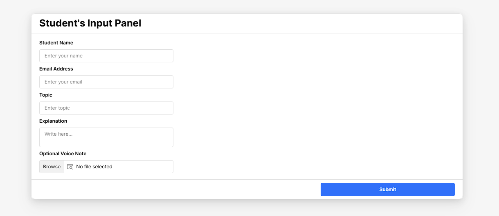
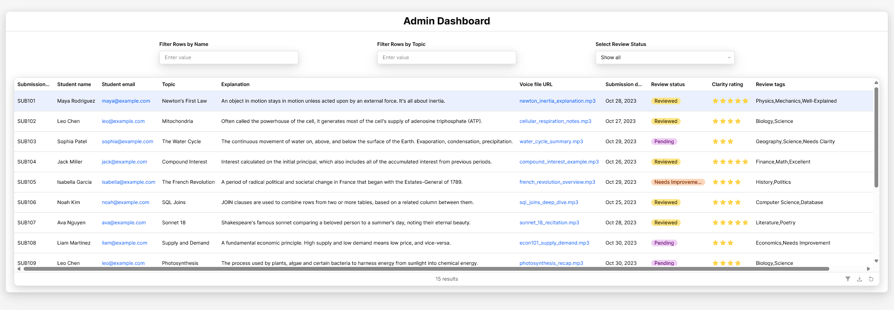
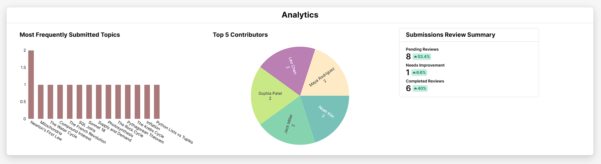

# Athena Learning - Retool Case Study Submission

This repository contains the submission for the Athena Internal Learning Dashboard case study. The project was completed within a single-day development sprint, demonstrating rapid and effective implementation of all core and bonus requirements.

---

## Live Application Screenshots

### 1. Student Submission Panel
*A clean and intuitive form for students to submit their concept explanations and optional voice notes.*

### 2. Admin Review Dashboard
*A powerful and filterable interface for staff to review, rate, and manage all student submissions. Features in-line editing and automatic duplicate detection.*

### 3. Analytics Dashboard
*A visual summary of platform engagement, showcasing the most popular topics, top student contributors, and a real-time summary of review statuses.*

---

## Project Components

This repository includes everything needed to review and run the application:

*   `athena-dashboard-retool-app.json`: The exported Retool application source code.
*   `PROJECT_REPORT.md`: A detailed report covering implementation decisions, challenges faced, and potential future improvements.
*   `Athena Learning DB.csv`: A sample dataset that can be imported into Google Sheets to immediately populate the application with data.
*   `/Screenshots`: A directory containing screenshots of the final application.

---

## How to Run the Application

To get the application running in your own Retool environment, please follow these steps:

**1. Prepare the Data Source:**
*   Go to [sheets.google.com](https://sheets.google.com) and create a new, blank spreadsheet.
*   Click `File` > `Import` > `Upload` and select the `Athena Learning DB.csv` file from this repository.
*   Choose "Replace spreadsheet" when prompted. The sheet will now be populated with the necessary data and headers.

**2. Configure Retool:**
*   In your Retool account, navigate to the **Resources** tab and create a new resource connection to **Google Sheets**, authorizing your account.
*   Go back to the **Apps** tab and create a new blank app.
*   From the app menu (three-dot icon in the top right), select **"Import an app from JSON"**.
*   Upload the `athena-dashboard-retool-app.json` file from this repository.

**3. Connect the Data:**
*   Once imported, the app will show errors because the queries are not connected to your data source.
*   Click on each query in the bottom panel (e.g., `getSubmissions`, `addSubmission`).
*   In the query editor, select the Google Sheets resource you created in step 2 and choose the spreadsheet you populated.
*   Once the `getSubmissions` query is correctly linked, the entire application will become functional.